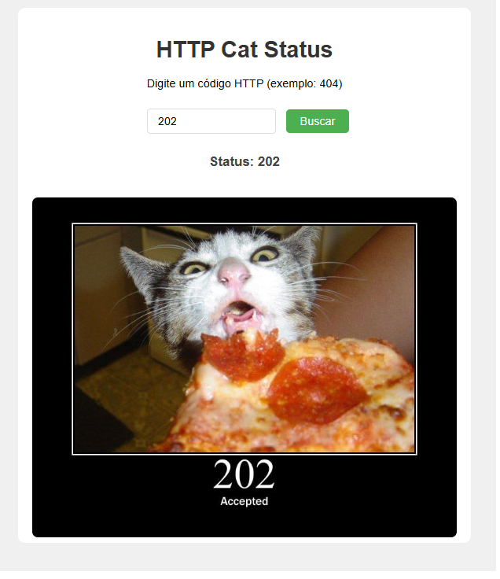

# 🐱 HTTP Cat Status

Projeto divertido e educativo que busca imagens de gatos representando **códigos de status HTTP**. Basta digitar um código (ex: 404) e ver um meme felino correspondente 🐾.

## ✨ Tecnologias Utilizadas

- **HTML5**
- **CSS3**
- **JavaScript (Vanilla)**
- **Bootstrap** (para estilização rápida e responsividade)

## 🚀 Funcionalidades

- Busca por código HTTP (ex: 200, 404, 500)
- Exibição de imagens temáticas dos status via [HTTP Cat API](https://http.cat)
- Layout leve e responsivo

## 📸 Preview

## 🧠 Objetivo do Projeto

Esse projeto foi criado para praticar:

- Manipulação de APIs com JavaScript
- Interação com o DOM em tempo real
- Estilização com Bootstrap e CSS
- Automação de testes com Cypress
- Integração divertida entre aprendizado e humor 😸
